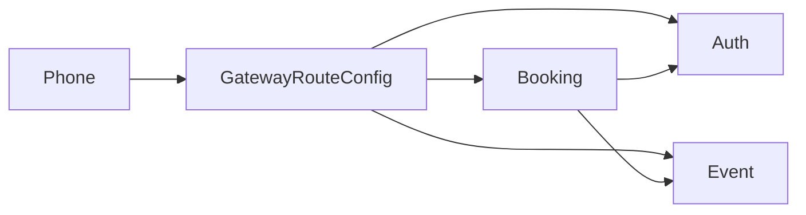
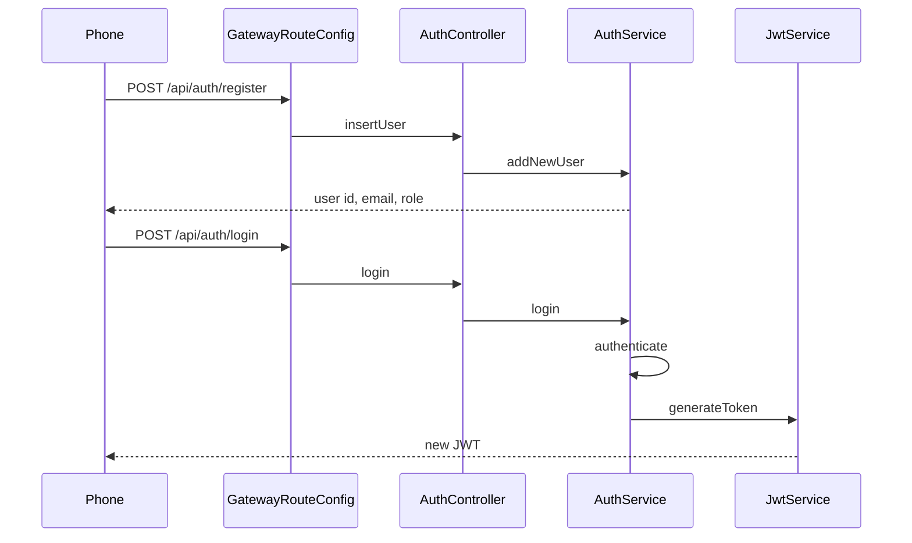
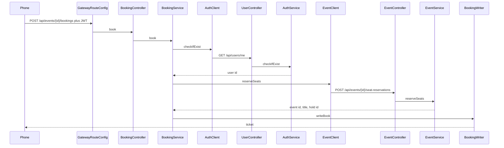
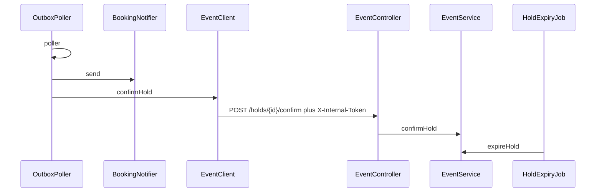

# Who calls whom

Memorize the method chain. The phone only reaches the gateway. The gateway has no business method. It forwards the path.

Say this first:

> The browser hits one gateway. The gateway only forwards. Booking is the only service that calls the others. Auth signs the token. Event owns the seats. Booking owns the ticket.

---

## The four boxes

| Box | Port | Database | Owns | Calls |
|---|---|---|---|---|
| Gateway | 8081 | none | nothing | forwards by path |
| Auth | 8082 | `authdb` | users, password hash | nobody |
| Event | 8083 | `eventdb` | venues, concerts, seat holds | nobody |
| Booking | 8080 | `bookingdb` | tickets, outbox rows | Auth, then Event |

Every service that receives a JWT runs the same check before the controller: `JwtAuthenticationFilter` calls `JwtService.parseToken`. Auth is the only one that also has `JwtService.generateToken`.

---

## Register and login

Register does not make a token.

Chain to say: `AuthController.login` → `AuthService.login` → `AuthService.authenticate` → `JwtService.generateToken`.

`generateToken` is `signWith(key)`. The key came from `JWT_SECRET`. Nothing stores that string. Next year's login calls `generateToken` again.

---

## Book

This is the chain to draw on a whiteboard.

Chain to say:

`BookingController.book` → `BookingService.book` → `AuthClient.checkIfExist` → `UserController.getUser` → `AuthService.checkIfExist` → `EventClient.reserveSeats` → `EventController.reserveSeats` → `EventService.reserveSeats` → `BookingWriter.writeBook`.

`EventService.reserveSeats` locks the concert row, takes the seats, and saves a hold for 10 minutes. `BookingWriter.writeBook` saves the ticket and two outbox rows in one commit. Email is not called here. Confirm is not called here.

On Event and on Auth, the JWT filter already ran `JwtService.parseToken` before those controllers. That is `verifyWith(key)`, the same `JWT_SECRET`.

My tickets is the short chain: `MyBookingsController.myBookings` → `BookingService.myBookings` → `AuthClient.checkIfExist`. The title comes off the ticket row. No call to Event.

---

## Later

The user is gone. `OutboxPoller.poller` wakes up inside Booking.

Chain to say: `OutboxPoller.poller` → `BookingNotifier.send` for the mail row, and `EventClient.confirmHold` → `EventController` confirm → `EventService.confirmHold` for the hold row.

`confirmHold` on the client sends `APP_INTERNAL_TOKEN`. Event's `InternalTokenFilter` checks it and sets role `INTERNAL`. A user JWT never gets that role.

`HoldExpiryJob` lives inside Event. It calls `EventService.expireHold` for each hold still `HELD` past its deadline. If a late confirm finds the hold expired, Event returns 409. `OutboxPoller.poller` sets the ticket to `CANCELLED`, then marks the outbox row sent.

---

## The two secrets

You invent each string once. The app does not create it.

| Secret | Who has it | Method that uses it |
|---|---|---|
| `JWT_SECRET` | Auth, Event, Booking | Auth `generateToken` signs. All three `parseToken` check. |
| `APP_INTERNAL_TOKEN` | Event, Booking | `EventClient.confirmHold` sends it. `InternalTokenFilter` compares it. |

---

## Five lines for the interview

1. The phone has one door, `GatewayRouteConfig`. It does not call `book` or `parseToken`.
2. `AuthService.login` builds a new token through `JwtService.generateToken`. We never load an old one.
3. `BookingService.book` calls `AuthClient.checkIfExist`, then `EventClient.reserveSeats`, then `BookingWriter.writeBook`.
4. `OutboxPoller.poller` calls `BookingNotifier.send` and `EventClient.confirmHold` after the user is gone.
5. `EventService.confirmHold` accepts only the internal token. `EventService.expireHold` gives the seats back.

---

## Traps

| Easy wrong answer | What is true |
|---|---|
| "The gateway validates the JWT." | `JwtAuthenticationFilter` on each service calls `parseToken`. |
| "We store the JWT and load it next year." | `generateToken` runs again on the next login. |
| "`book` sends the email." | `BookingWriter.writeBook` saves an outbox row. `BookingNotifier.send` runs from `OutboxPoller.poller`. |
| "Confirm uses the user's token." | `EventClient.confirmHold` sends `X-Internal-Token`. |
| "Booking joins the event table." | `writeBook` stores `eventId` and `eventTitle` on the ticket. |
